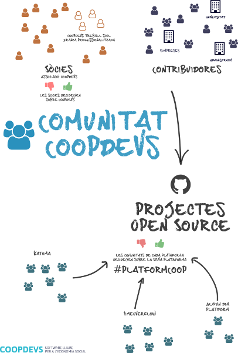
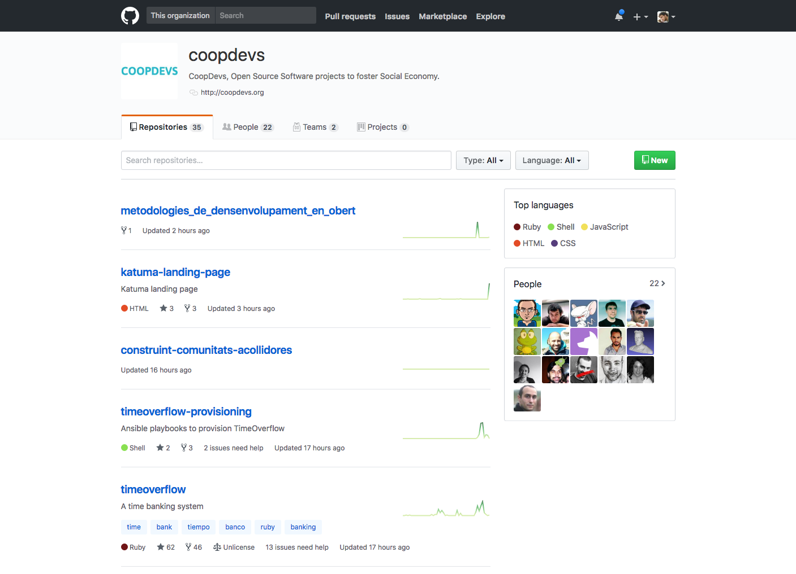
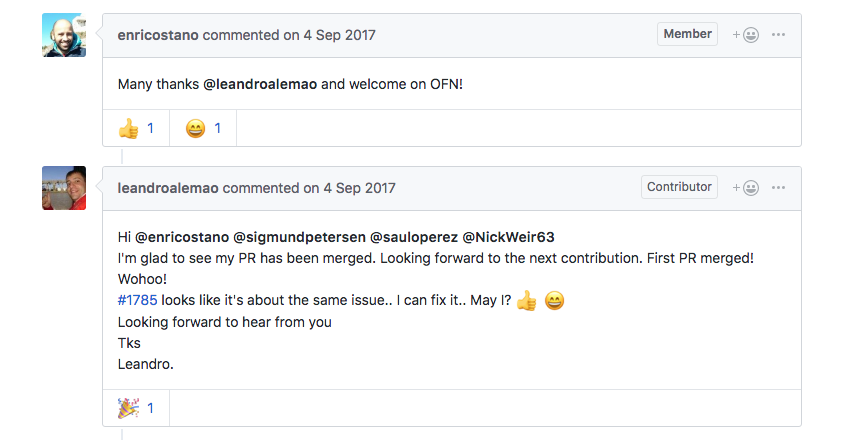
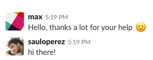
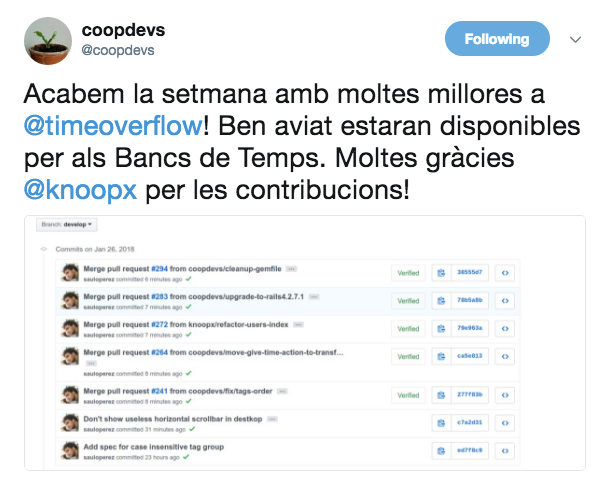
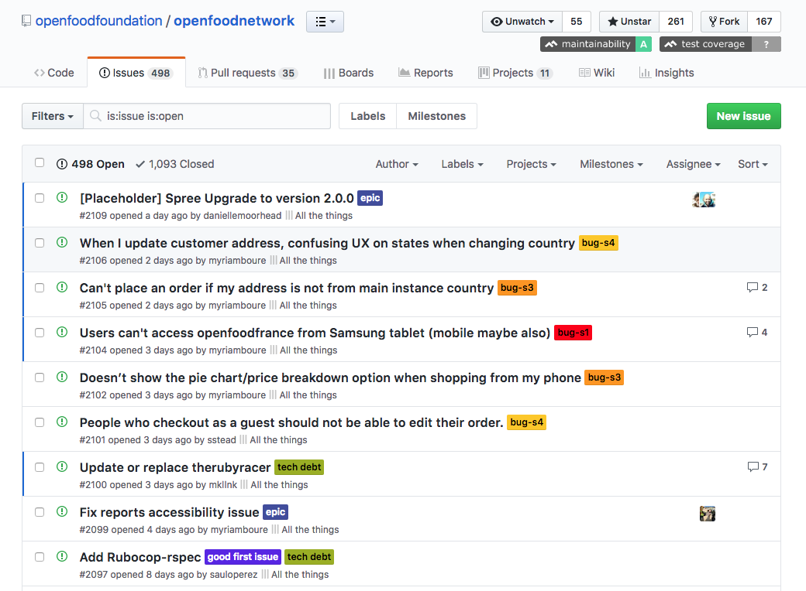
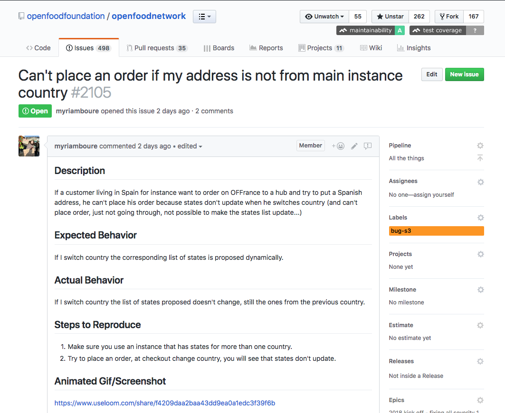
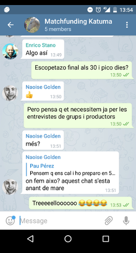
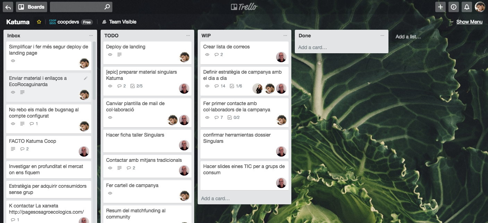
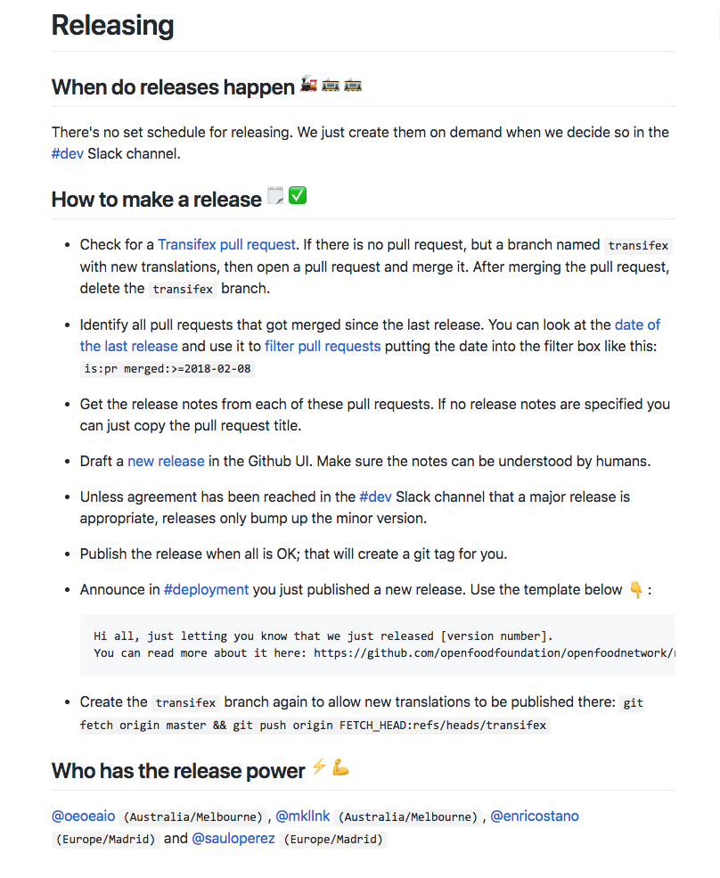

class: impact

## Modelos de negocio 
## Proyectos de código abierto

---
background-image: radial-gradient(rgba(58, 64, 122, 0.75), rgba(58, 64, 122, 0.85)), url(images/coop.png)

# Coopdevs

## Sergi Alonso [@sseerrggii](https://twitter.com/sseerrggii)


* [coopdevs.org](http://coopdevs.org/)
* [twitter.com/coopdevs](https://twitter.com/coopdevs)
* [github.com/coopdevs](https://github.com/coopdevs)
* [gitlab.com/coopdevs](https://gitlab.com/coopdevs)
* [community.coopdevs.org](http://community.coopdevs.org/)

---

background-image: url(images/FOSDEM.jpeg)

---
background-image: url(images/katuma.png)

## Katuma


---
background-image: url(images/TimeOverflow.png)

## TimeOverflow


---
background-image: radial-gradient(rgba(58, 64, 122, 0.75), rgba(58, 64, 122, 0.85)), url(images/odoo.jpg)

## ERP para entidades de la ESS
## Procesos empresariales
---
background-image:  url(images/socialissues_logo.png)

## Socialissues.tech

---
background-image: radial-gradient(rgba(58, 64, 122, 0.75), rgba(58, 64, 122, 0.85)), url(images/technology.jpg)

## Tecnología & governanza


.footer[Photo by Johannes Plenio on Unsplash]

---
## Cooperativismo de Plataforma

.center[]

---

## ¿No podemos competir? 
# Intercooperamos en IT

---
background-image: radial-gradient(rgba(58, 64, 122, 0.75), rgba(58, 64, 122, 0.85)), url(images/git.png)

## Sistemas de control de versiones

Desarollo de software de manera colaborativa

---
background-image: radial-gradient(rgba(58, 64, 122, 0.75), rgba(58, 64, 122, 0.85)), url(images/social_coding.png)

## GitHub & GitLab

Plataformas de desarrollo de software

* Alojamiento del código
* Revisión del codigo
* Gestión del projecto
* *Social coding*
* Licencia

---

## Social coding

La red social de las desarrolladoras de software :P



---
background-image: radial-gradient(rgba(58, 64, 122, 0.75), rgba(58, 64, 122, 0.85)), url(images/simbiosi.jpg)

## Simbiosi

Proyecto & Contribuidoras
.footer[Photo by Larm Rmah on Unsplash]

---
background-image: radial-gradient(rgba(58, 64, 122, 0.75), rgba(58, 64, 122, 0.85)), url(images/simbiosi.jpg)

## Simbiosi 

Proyecto con recursos humanos dinámicos

.footer[Photo by Larm Rmah on Unsplash]
---
background-image: radial-gradient(rgba(58, 64, 122, 0.75), rgba(58, 64, 122, 0.85)), url(images/simbiosi.jpg)

## Simbiosi

El Contribuidor egoista

Ego & CV

---
background-image: radial-gradient(rgba(58, 64, 122, 0.75), rgba(58, 64, 122, 0.85)), url(images/atomic_ant.jpg)

## Humanos

Proyectos desarrollados por humanos

aunque solo veamos avatar i emoticonos

---

### Humanos

Con sentimientos y estados de ánimo



---

### Humanos



---

### Humanos

Dar las gracias es importante



---

## Humanos

Nos cuesta estructurar y comunicar ideas abstractas

---
background-image: radial-gradient(rgba(58, 64, 122, 0.75), rgba(58, 64, 122, 0.85)), url(images/agile.jpg)
## Organización


.footer[Photo by Patrick Perkins on Unsplash]

---

## Organización

*issues* bien detallados y al día



---



---

## Organitzación

Tareas más allà del software



---

Software de gestión de proyectos



---
background-image: radial-gradient(rgba(58, 64, 122, 0.75), rgba(58, 64, 122, 0.85)), url(images/agil_obert.jpg)

## Agil y en abierto


.footer[Photo by Erik Odiin on Unsplash]

---

##  Agil y en abierto

*Desarollo veloz*

# =

** Efectividad y felicidad**

---

## Agil y en abierto

*Animar, facilitar y acompañar asegurando que se cumplen los objetivos del proyecto*

# =

**Comunidades acogedoras**


---

## Procesos

Reduce el margen de error

### Cosas simples, aburridas i repetitives

---

## Procesos

```shell
$ automatiza
```

.footer[Alert!]

---

## Documentación

El proyecto debe seguir
aunque tu tengas amnesia

---

## Documentación

* No lo podemos recordar todo
* Más facilmente alguien puede sumarse

---

No guardes nada en tu cabeza



---

haz documentación ejecutable


---
## Modelos de negocio, algunos ejemplos

## [platform.coop](https://platform.coop/)

-

-

-

## Y cercanos WIP...

---
background-image: radial-gradient(rgba(58, 64, 122, 0.75), rgba(58, 64, 122, 0.85)), url(images/fairbnb.png)

##[Fairbnb.coop](https://www.fairbnb.coop/)

---
background-image: radial-gradient(rgba(58, 64, 122, 0.75), rgba(58, 64, 122, 0.85)), url(images/mensakas.png)

## [Mensakas.com](https://www.mensakas.com/)

---
background-image: radial-gradient(rgba(58, 64, 122, 0.75), rgba(58, 64, 122, 0.85)), url(images/foodcoop.png)

## [foodcoopbcn.cat](https://foodcoopbcn.cat/)

---
background-image: url(images/carretera.jpg)

## Preguntas?
.footer[Photo by Matthias Heil on Unsplash]

---
background-image: radial-gradient(rgba(58, 64, 122, 0.75), rgba(58, 64, 122, 0.85)), url(images/coopdevs_logo.jpg)
# Gràcies

Slides disponibles en

[https://github.com/coopdevs/models-de-negoci-projectes-amb-codi-obert](https://github.com/coopdevs/models-de-negoci-projectes-amb-codi-obert)

